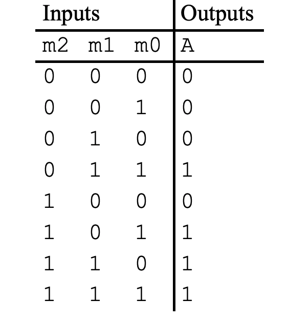
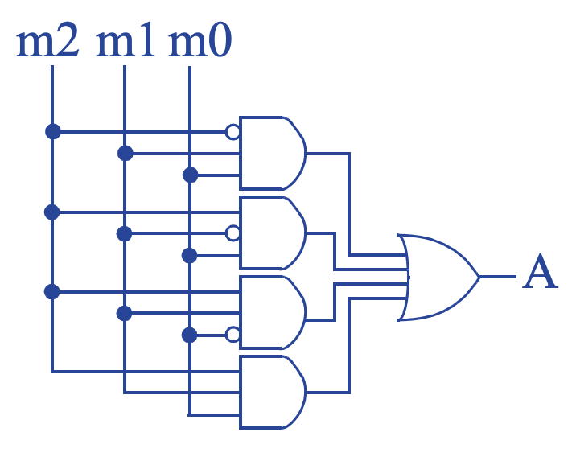
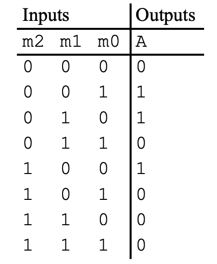
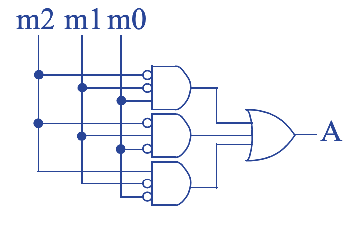
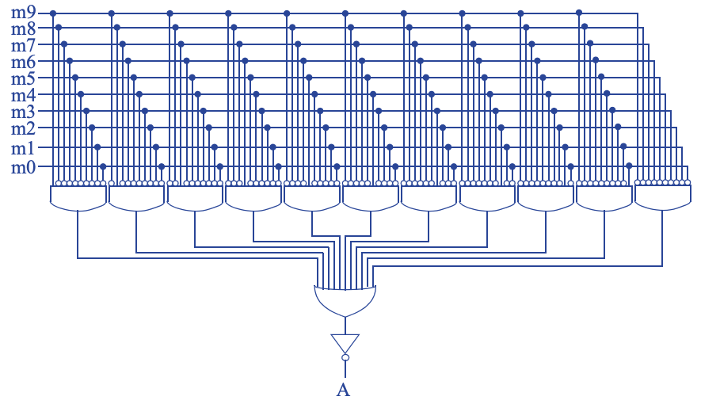
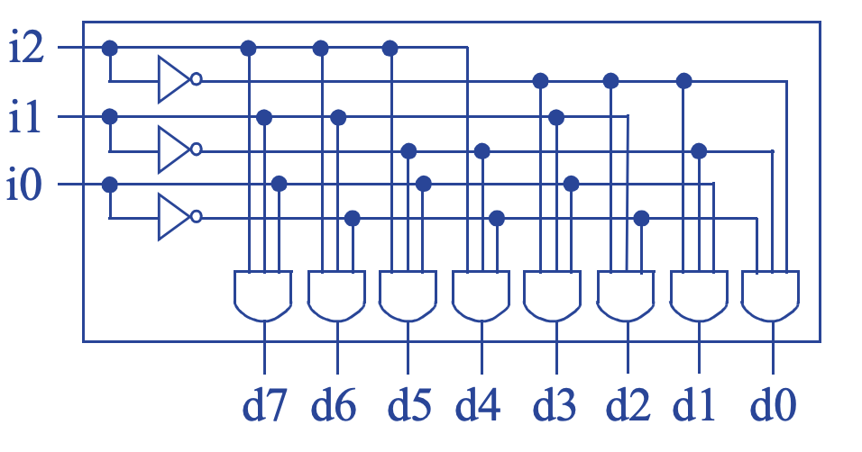
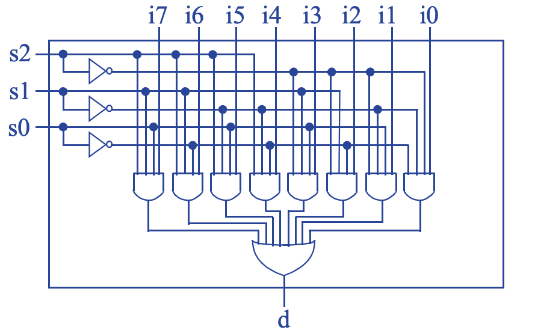
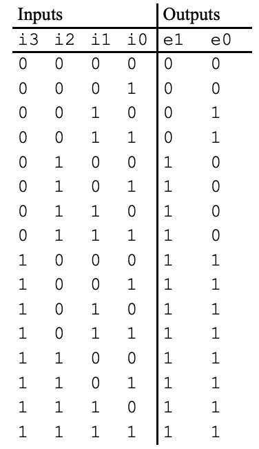
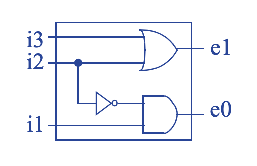

**Note:** for the following design questions, show the truth table, boolean
experssion, and circuit if possible.

## (5 pts)
A museum has three rooms, each with a motion sensor (m0, m1, and m2) that outputs 1 when motion is detected. At night, the only person in the museum is one security guard who walks from room to room. Create a circuit that sounds an alarm (by setting an output A to 1) if motion is ever detected in more than one room at a time (i.e., in two or three rooms), meaning there must be one or more intruders in the museum. Start with a truth table.

> Step 1 - Capture the function  
>   
> Step 2A - Create equations  
> A = m2’m1m0 + m2m1’m0 + m2m1m0’ + m2m1m0  
> Step 2B- Implement as a gate-based circuit  
> 

## (5 pts)
 Create a circuit for the museum of exercise above that detects whether the guard is properly patrolling the museum, detected by exactly one motion sensor being 1. (If no motion sensor is 1, the guard may be sitting, sleeping, or absent). 

> Step 1 - Capture the function  
>   
> Step 2A - Create equations  
> A = m2’m1’m0 + m2’m1m0’ + m2m1’m0’  
> Step 2B- Implement as a gate-based circuit  
> 

## (5 pts)
Consider the museum security alarm function of exercise above, but for a museum with 10 rooms. A truth table is not a good starting point (too many rows), nor is an equation describing when the alarm should sound (too many terms). However, the inverse of the alarm function can be straightforwardly captured as an equation. Design the circuit for the 10 room security system, by designing the inverse of the function, and then just adding an inverter before the circuit’s output. 

> Step 1 - Capture the function  
> The inverse function detects that motion is detected by exactly one motion sensor, or no motion sensor detecting motion; all the other possibilities are for two or more sensors detecting motion. Thus, the inverse function can be written as:  
> A’ =  
> m9m8’m7’m6’m5’m4’m3’m2’m1’m0’ + m9’m8m7’m6’m5’m4’m3’m2’m1’m0’ +  
> m9’m8’m7m6’m5’m4’m3’m2’m1’m0’ + m9’m8’m7’m6m5’m4’m3’m2’m1’m0’ +  
> m9’m8’m7’m6’m5m4’m3’m2’m1’m0’ + m9’m8’m7’m6’m5’m4m3’m2’m1’m0’ +  
> m9’m8’m7’m6’m5’m4’m3m2’m1’m0’ + m9’m8’m7’m6’m5’m4’m3’m2m1’m0’ +  
> m9’m8’m7’m6’m5’m4’m3’m2’m1m0’ + m9’m8’m7’m6’m5’m4’m3’m2’m1’m0 +  
> m9’m8’m7’m6’m5’m4’m3’m2’m1’m0’  
> The first term is for motion sensor m9 detecting motion and all others detecting no motion, the second term is for m8, and so on. That last term is for no sensor detecting motion.  
> Step 2A - Create equations  
> Already done.  
> Step 2B- Implement as a gate-based circuit  
> 

## (5 pts)
Two people, denoted using variables A and B, want to ride with you on your motorcycle. Write a Boolean equation that indicates that exactly one of the two people can come (A=1 means A can come, A=0 means A can’t come). Then use XOR to simplify your equation.

> F = A’B + AB’
> F = A XOR B

## (5 pts)
Design a 3x8 decoder using AND, OR and NOT gates.

> 

## (5 pts)
Design an 8x1 multiplexer using AND, OR and NOT gates.

> 

## (5 pts)
Design a 4x2 **priority encoder** using AND, OR and NOT gates. If every input is 0, the output should be “00”. (Hint: encoder and priority encoder is not fully discussed in class, but they are easy to understand once you know decoder and multiplexer. Search online for priority encoder to learn its functionalities before attempting the question.)

>   
> e1 = i3 + i2  
> e0 = i3 + i2’i1  
> 
